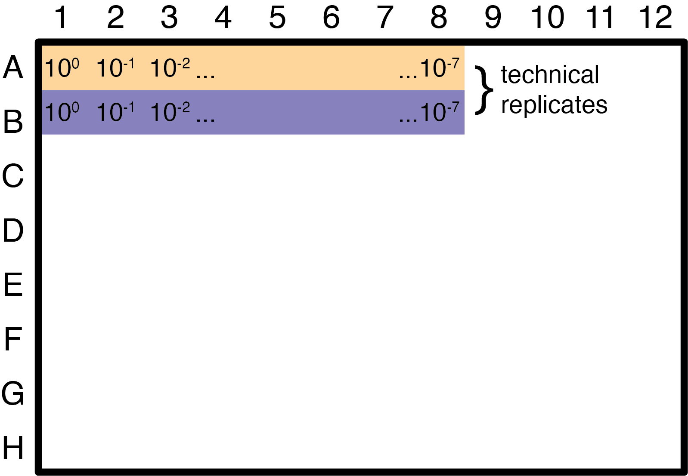
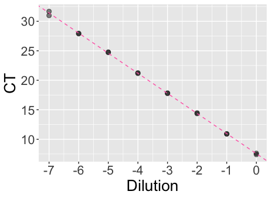

# DANG_qPCR_example
An example qPCR dataset to use for plotting a standard curve and calculating qPCR efficiency. 

*This data was kindly made available by Samantha Kasbohm, a student in the Lauring Lab at the University of Michigan.*

## Goals for this exercise

1. Plot the qPCR standard curve
2. Calculate qPCR efficiency

## Explanation of the dataset

A qPCR standard curve is useful for determining the efficiency of a qPCR reaction for a specific set of primers and a template. To generate this curve, serial dilutions are made of the template (usually a plasmid). In this dataset, 7 dilutions were made from the original template concentration. See the plate layout below:

A CT (cycle threshold) value is obtained for each dilution using an Applied Biosystems machine. The output file can be downloaded here. The tab-separated file contains many more columns than what is required for this exercise.

Next, the CT values are plotted and used to fit a linear model. The plot below was made using ggplot2, but feel free to use any plotting library you like.

The slope of the resulting model can be used to calculate a PCR efficiency according to the equation:

$10^{(1/-slope)}-1$

In this example, the qPCR efficiency is ~96%
